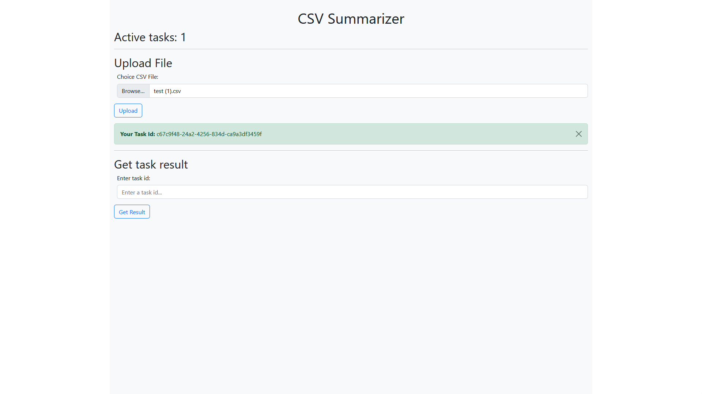
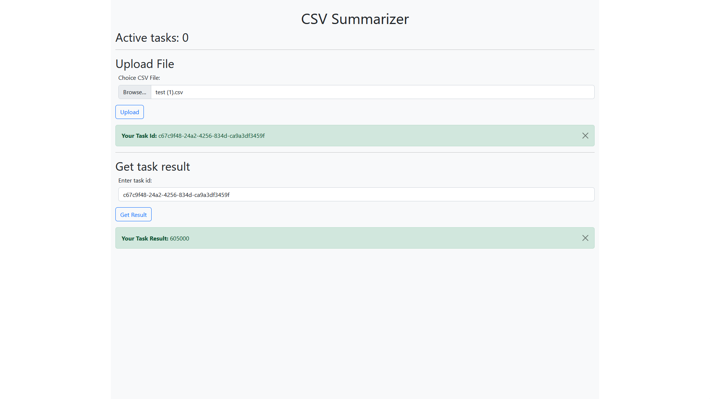

# 📃 About

The **CSV Summarizer** is a web application that allows users to upload CSV files via a RESTful API built with Django Rest Framework (DRF) to get the sum of every second column of file. The application provides a seamless integration between the frontend, developed using Vue.js, and the backend, which handles file uploads and processing tasks using Celery.
> The project is a test task.

# 💽 Installation

1. Clone or download the repository.
2. Create a virtual environment and install requirements from requirements/local.txt file.
3. Create an **.env** file or rename **.env.dist** in **.env** and populate it with all variables from **.env.dist**
   file.
4. Make migrations:
    * `python manage.py makemigrations`
    * `python manage.py migrate`
5. Run redis:
    * [**Windows**](https://github.com/microsoftarchive/redis/releases)
    * [**Linux**](https://www.digitalocean.com/community/tutorials/how-to-install-and-secure-redis-on-ubuntu-22-04)
6. Run celery:
    * **Windows:** `celery -A core worker -l info -P eventlet`
    * **Linux:** `celery -A core worker -l INFO`
7. Run server:
    * `python manage.py runserver`
8. Go to: http://127.0.0.1:8000

# 🌄 Demonstration

